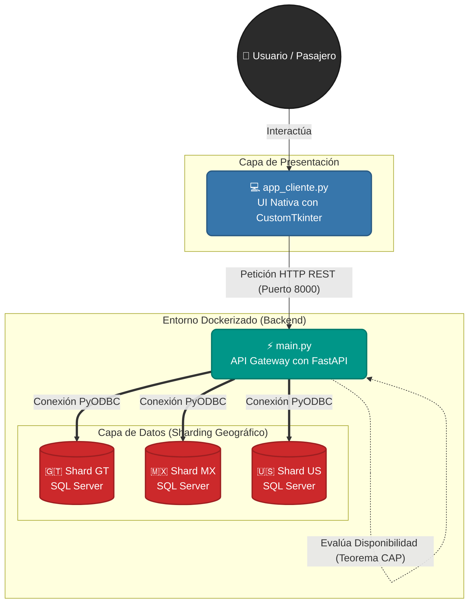

```mermaid
graph TD
    %% Clases de diseño limpias
    classDef python fill:#3776AB,stroke:#2b5b84,stroke-width:2px,color:#fff,rx:8,ry:8
    classDef fastapi fill:#009688,stroke:#00796b,stroke-width:2px,color:#fff,rx:8,ry:8
    classDef sqlserver fill:#CC292B,stroke:#9e1f21,stroke-width:2px,color:#fff,rx:8,ry:8
    classDef external fill:#2b2b2b,stroke:#1a1a1a,stroke-width:2px,color:#fff,rx:8,ry:8

    %% Nodo externo
    Usuario(("👤 Usuario / Pasajero")):::external

    %% Capas de Arquitectura (Nombres de subgrafos compatibles con GitHub)
    subgraph Presentacion ["Capa de Presentación"]
        App["💻 app_cliente.py<br>UI Nativa con CustomTkinter"]:::python
    end

    subgraph Backend ["Entorno Dockerizado (Backend)"]
        API["⚡ main.py <br>API Gateway con FastAPI"]:::fastapi
        
        subgraph Datos ["Capa de Datos (Sharding Geográfico)"]
            DB_GT[("🇬🇹 Shard GT<br>SQL Server")]:::sqlserver
            DB_MX[("🇲🇽 Shard MX<br>SQL Server")]:::sqlserver
            DB_US[("🇺🇸 Shard US<br>SQL Server")]:::sqlserver
        end
    end

    %% Flujo de datos
    Usuario -->|"Interactúa"| App
    App -->|"Petición HTTP REST (Puerto 8000)"| API
    
    %% Lógica de Gateway
    API -.->|"Evalúa Disponibilidad (Teorema CAP)"| API
    
    %% Conexiones a BD
    API ==>|"Conexión PyODBC"| DB_GT
    API ==>|"Conexión PyODBC"| DB_MX
    API ==>|"Conexión PyODBC"| DB_US

```
